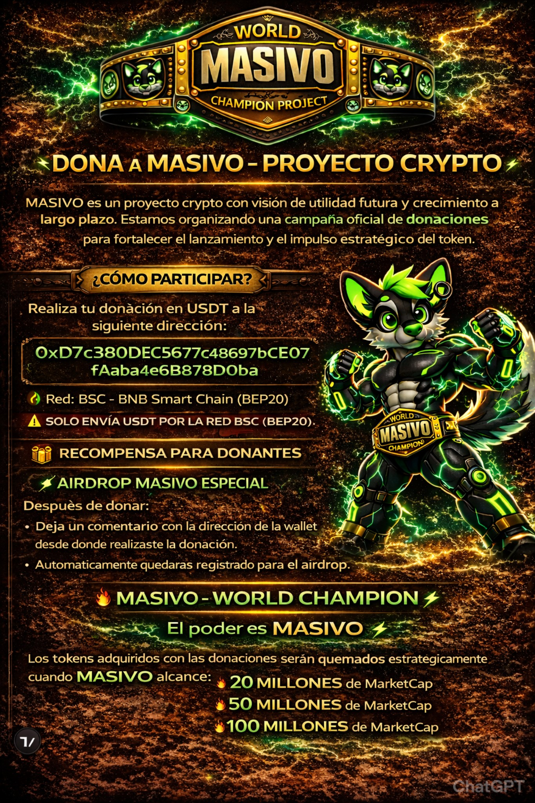

# MASIVO

## Official Donation Address
CLICK ON THE LINK https://1masivo1.github.io
HAGA CLIC EN EL ENLACE https://1masivo1.github.io

**Network:** BNB Smart Chain (BEP-20)  
**Token:** USDT (BEP-20)  
**Donation Address:**  
`0xD7c380DEC5677C48697bCE07fAaba4e6B878D0ba`

Only send USDT via BNB Smart Chain (BEP-20). Sending funds through other networks may result in permanent loss.

---

## Official Channels

**X (Twitter):** [@1MASIVO1](https://x.com/1MASIVO1)  
**Email:** [1masivo1@gmail.com](mailto:1masivo1@gmail.com)

---

## 🇺🇸 English Version

---

## 🇪🇸 Spanish Version

---

## About MASIVO

MASIVO is a crypto initiative focused on strategic positioning and long-term development.  
This repository contains the official promotional materials and donation information.

All donations must be sent using:
- BNB Smart Chain (BEP-20)
- USDT token only

---

## Disclaimer

Cryptocurrency transactions involve risk.  
Always verify the official address before sending funds.  
The MASIVO team is not responsible for funds sent to incorrect addresses.
